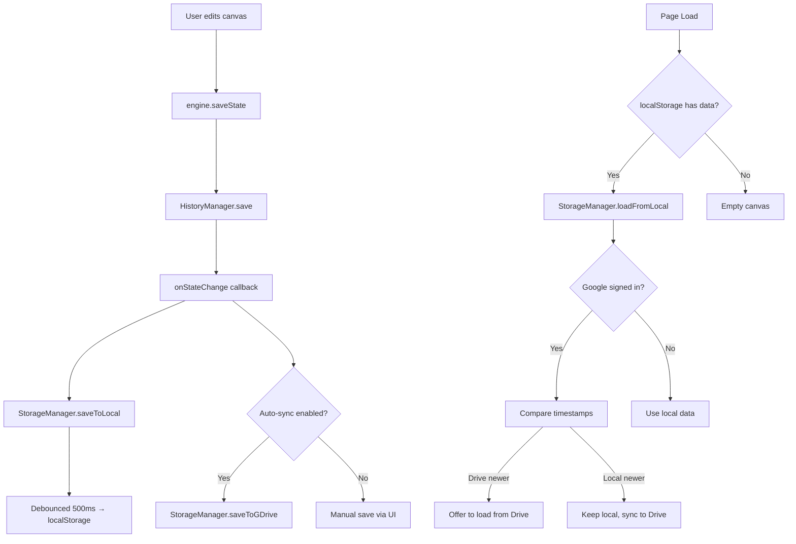
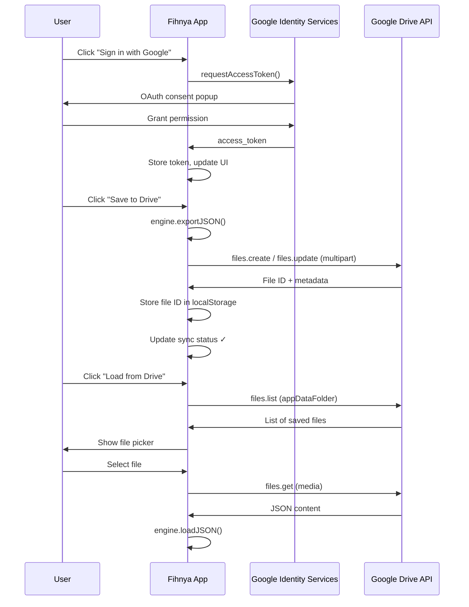

# Google Drive Integration + LocalStorage Persistence for Fihnya

## Background

Currently Fihnya has **no persistence** — all user work is lost on page reload. The only way to save is manual JSON export. We need:

1. **Auto-save to localStorage** — instant, always-on, survives page reload
2. **Google Drive sync** — cloud backup, cross-device access

## User Review Required

> [!IMPORTANT]
> **Google Cloud Console setup required.** You need to create a Google Cloud project with:
> - Google Drive API enabled
> - OAuth 2.0 Client ID (Web application type)
> - Authorized JavaScript origins pointing to your domain (or `http://localhost:PORT` for dev)
> 
> The Client ID will be placed as a constant in the code. **Do you already have a Google Cloud project, or should I guide you through creating one?**

> [!WARNING]
> **Scope choice: `drive.file` vs `drive.appdata`**
> - `drive.file` — app can only access files it created. User can see the file in their Drive.
> - `drive.appdata` — hidden app folder, user can't see files. Cleaner but less transparent.
> 
> **I recommend `drive.appdata`** for a cleaner UX (no random JSON files visible in user's Drive). The user manages everything through the app UI. Let me know if you prefer `drive.file` instead.

## Proposed Changes

### 1. Storage Layer — `StorageManager`

#### [NEW] [StorageManager.js](file:///c:/Users/velyc/Desktop/Fihnya/js/core/StorageManager.js)

Central persistence orchestrator. Responsibilities:

- **localStorage auto-save**: debounced (500ms) save on every `engine.saveState()` call
- **localStorage auto-load**: on app startup, restore last session
- **Google Drive auth**: manage OAuth token lifecycle via GIS
- **Google Drive save**: upload project JSON to Drive (manual + optional auto-sync)
- **Google Drive load**: download and restore from Drive
- **Conflict resolution**: simple "last-write-wins" with timestamp comparison
- **Sync status tracking**: `idle`, `saving`, `syncing`, `error` states

```
Key API surface:
├── saveToLocal()          — serialize engine state → localStorage
├── loadFromLocal()        — localStorage → engine.loadJSON()
├── initGoogleAuth()       — setup GIS token client
├── signIn()               — trigger OAuth popup
├── signOut()              — revoke token
├── isSignedIn()           — check auth status
├── saveToGDrive()         — upload JSON to Google Drive
├── loadFromGDrive()       — download JSON from Google Drive
├── listGDriveFiles()      — list saved projects in app folder
├── deleteFromGDrive(id)   — delete a project file
└── syncStatus             — observable state for UI
```

**localStorage schema:**
```json
{
  "fihnya-workspace": {
    "version": 1,
    "lastModified": "2026-04-11T19:00:00Z",
    "projectName": "Без назви",
    "data": { "shapes": [...], "links": [...] }
  },
  "fihnya-gdrive-token": "...",
  "fihnya-gdrive-file-id": "..."
}
```

---

### 2. Google Drive Cloud Sync Panel

#### [NEW] [CloudPanel.js](file:///c:/Users/velyc/Desktop/Fihnya/js/ui/CloudPanel.js)

A dropdown/popover UI accessible from the toolbar header. Features:

- **Sign in / Sign out** button with Google avatar display
- **Sync status indicator** (cloud icon with state: synced ✓, syncing ↻, error ✗)
- **"Save to Drive"** button (manual trigger)
- **"Load from Drive"** button (opens file picker from saved projects)
- **Last synced timestamp** display
- **Project name** editable field (currently hardcoded as "Без назви")

Visual design: matches existing dark theme, glassmorphism dropdown style.

---

### 3. Integration Points

#### [MODIFY] [index.html](file:///c:/Users/velyc/Desktop/Fihnya/index.html)

- Add Google API scripts (`gapi` + GIS)
- Add `CloudPanel.js` and `StorageManager.js` script tags
- Add cloud sync button in toolbar-right section
- Add cloud panel dropdown HTML

#### [MODIFY] [engine.js](file:///c:/Users/velyc/Desktop/Fihnya/js/engine.js)

- Add `onStateChange` callback (fired after every `saveState()` call)
- This allows StorageManager to hook into state changes for auto-save

#### [MODIFY] [History.js](file:///c:/Users/velyc/Desktop/Fihnya/js/core/History.js)

- After `save()`, fire `engine.callbacks.onStateChange()` to trigger auto-save

#### [MODIFY] [app.js](file:///c:/Users/velyc/Desktop/Fihnya/js/app.js)

- Initialize `StorageManager` and `CloudPanel`
- On startup: attempt `loadFromLocal()` before initial render
- Wire up `onStateChange` → `storageManager.saveToLocal()`
- Wire up cloud panel buttons to storage manager methods

#### [MODIFY] [styles.css](file:///c:/Users/velyc/Desktop/Fihnya/styles.css)

- Cloud sync button styles (with animated sync indicator)
- Cloud panel dropdown styles (glassmorphism, dark theme)
- Google sign-in button styling
- Sync status indicator animations (pulse for syncing, green check for synced, red for error)

---

## Architecture Flow



## Data Flow: Google Drive Save/Load



## Open Questions

> [!IMPORTANT]
> 1. **Do you have a Google Cloud project?** If not, I'll include a step-by-step setup guide, but you'll need to create the project and get the Client ID yourself.
> 2. **Scope preference**: `drive.appdata` (hidden folder, recommended) vs `drive.file` (visible in user's Drive)?
> 3. **Multi-project support**: Should we support saving multiple projects to Drive, or just one active workspace?
> 4. **Auto-sync frequency**: Should Google Drive sync happen automatically on every change (debounced ~5s), or only on manual "Save to Drive" button click?

## Verification Plan

### Automated Tests
- Open in browser, draw shapes, close tab, reopen → shapes restored from localStorage
- Sign in with Google, save to Drive, clear localStorage, load from Drive → shapes restored
- Test sync status indicator transitions (idle → saving → synced)
- Test error handling: revoke token mid-session → graceful error UI

### Manual Verification
- Verify OAuth popup works correctly
- Verify Google Drive file is created/updated in the correct folder
- Cross-browser test: save in Chrome, load in Firefox (via Drive)
- Test with large projects (many shapes with images)
